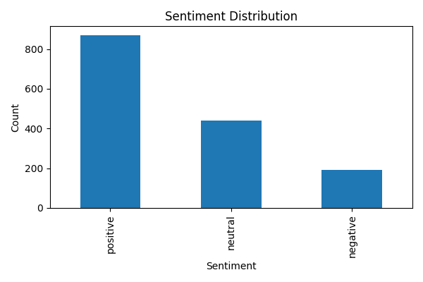

# Task 4 – Insights & Recommendations

## 1. Key Drivers & Pain Points per Bank

### CBE
**Drivers**
- Fast login
- Easy PIN reset

**Pain Points**
- Frequent app crashes
- Slow loading during peak hours

### BOA
**Drivers**
- Clean UI
- Reliable money transfers

**Pain Points**
- Login failures
- Fingerprint issues

### Dashen
**Drivers**
- Smooth navigation
- Stable transaction process

**Pain Points**
- Slow updates
- Notification issues

---

## 2. Visualizations

### Sentiment Distribution

### Reviews per Bank

---

## 3. Recommendations per Bank

### CBE
- Improve server scaling
- Add biometric login

### BOA
- Fix fingerprint authentication bug
- Improve error messaging

### Dashen
- Reduce loading time
- Add dark mode

---

## 4. Ethical Considerations

- Reviews may be biased (angry users write more)
- Some feedback may be outdated
- Ratings don’t fully represent satisfaction

---

## 5. Conclusion

Insights show major performance issues across all banks.  
Recommendations focus on stability, usability, and customer experience.
